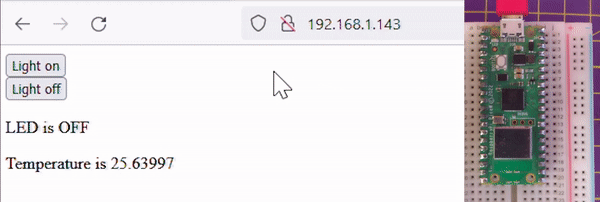

## Introduction

Raspberry Pi Pico W is a new Raspberry Pi product that adds Wi-Fi capability to Raspberry Pi Pico, allowing you to connect the device to a Wi-Fi network. In this guide, you will learn how to use Raspberry Pi Pico W connect to a WiFi network and then how to turn it into a web server to control digital outputs from a browser, and receive sensor data.

**WiFi** enabled devices allow for easy communication between computers and the Internet. The technology helped kick start the Internet Of Things (IOT) revolution.

You will:
+ Connect your Raspberry Pi Pico W to a WiFi hub
+ Create a Web Server on your Raspberry Pi Pico, to display a web page
+ Use your web page to control Raspberry Pi Pico onboard LED and to receive temperature data from it.

You will need:
+ A Raspberry Pi Pico W and microUSB data cable
+ A computer connected to your network
+ The Thonny Python IDE

[[[thonny-install]]]

[[[change-theme-thonny]]]

