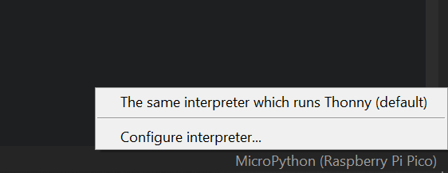

## Configurer ton Raspberry Pi Pico W

Connecte ton Raspberry Pi Pico W et configure MicroPython.

MicroPython est une version du langage de programmation Python pour les microcontrôleurs, comme ton Raspberry Pi Pico W. MicroPython te permet d'utiliser tes connaissances Python pour écrire du code pour interagir avec des composants électroniques.

\--- task ---

Télécharge la dernière version du firmware Raspberry Pi Pico W à [https://rpf.io/pico-w-firmware](https://rpf.io/pico-w-firmware)

\--- /task ---

\--- task ---

**Connecte** la petite extrémité de ton câble micro USB au Raspberry Pi Pico W.

\--- /task ---

\--- task ---

Maintiens enfoncé le bouton **BOOTSEL** de ton Raspberry Pi Pico W.

\--- /task ---

\--- task ---

**Connecte** l'autre extrémité à ton ordinateur de bureau, ordinateur portable, ou Raspberry Pi.

\--- /task ---

\--- task ---

Ton gestionnaire de fichiers devrait s'ouvrir, le Raspberry Pi Pico étant affiché comme un lecteur connecté à l'extérieur. Glisse et dépose le fichier firmware que tu as téléchargé dans le gestionnaire de fichiers. Ton Raspberry Pi Pico devrait se déconnecter et le gestionnaire de fichiers se fermera.

\--- /task ---

\--- task ---

Ouvre l'éditeur Thonny.

\--- /task ---

\--- task ---

Regarde le texte dans le coin inférieur droit de l'éditeur Thonny. Il te montrera la version de Python utilisée.

Si « MicroPython (Raspberry Pi Pico) » n'est **pas** indiqué, clique sur le texte et sélectionne « MicroPython (Raspberry Pi Pico) » dans les options.

\--- /task ---

\--- task ---

**Débogage :**

## --- collapse ---

## title: Je ne sais pas si le firmware est installé et je n'arrive pas à me connecter à mon Pico

Assure-toi que ton Raspberry Pi Pico W est connecté à ton ordinateur avec un câble micro USB. Clique sur la liste dans le coin inférieur droit de ta fenêtre Thonny. Un menu contextuel apparaîtra, qui répertorie les interprètes disponibles.

Si tu ne vois pas Pico dans la liste (comme indiqué sur l'image), tu dois reconnecter ton Raspberry Pi Pico W tout en maintenant le bouton BOOTSEL pour le monter en tant que volume de stockage, puis réinstaller le firmware en suivant les instructions de la section ci-dessus.

\--- /collapse ---

## --- collapse ---

## title: Le firmware est installé mais je ne parviens toujours pas à me connecter à mon Pico

Tu utilises peut-être le mauvais type de câble micro USB. Your current micro USB cable may be damaged, or designed to only carry power to devices and not transfer data. Try swapping your cable for another if nothing else has worked.

If your Pico still won't connect after trying all these things, it may **itself** be damaged and unable to connect.

\--- /collapse ---

\--- /task ---

For newcomers to Raspberry Pi Pico, `picozero` is a MicroPython library that's beginner-friendly.

\--- task ---

To complete the projects in this path, you need to install the `picozero` library as a Thonny package.

In Thonny, choose **Tools** > **Manage packages**.

\--- /task ---

\--- task ---

In the pop-up 'Manage packages for Raspberry Pi Pico' window, type `picozero` and click **Search on PyPi**.

\--- /task ---

\--- task ---

Click on **picozero** in the search results.

Click on **Install**.

When installation has completed, close the package window, then quit and reopen Thonny.

\--- /task ---

If you have difficulties installing the `picozero` library in Thonny, you can download the library file and save it to your Raspberry Pi Pico W.

[[[picozero-offline-install]]]
