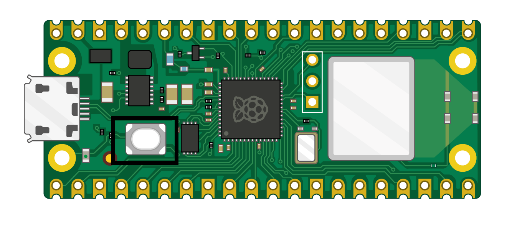

## Configurer ton Raspberry Pi Pico W

Connecte ton Raspberry Pi Pico W et configure MicroPython.

MicroPython est une version du langage de programmation Python pour les microcontrôleurs, comme ton Raspberry Pi Pico W. MicroPython te permet d'utiliser tes connaissances Python pour écrire du code pour interagir avec des composants électroniques.

\--- task ---

Télécharge la dernière version du firmware Raspberry Pi Pico W sur [https://rpf.io/pico-w-firmware](https://rpf.io/pico-w-firmware)

\--- /task ---

\--- task ---

**Connecte** la petite extrémité de ton câble micro USB au Raspberry Pi Pico W.

\--- /task ---

\--- task ---

Maintiens enfoncé le bouton **BOOTSEL** de ton Raspberry Pi Pico W.

\--- /task ---

\--- task ---

**Connecte** l'autre extrémité à ton ordinateur de bureau, ordinateur portable, ou Raspberry Pi.

\--- /task ---

\--- task ---

Ton gestionnaire de fichiers devrait s'ouvrir, le Raspberry Pi Pico étant affiché comme un lecteur connecté à l'extérieur. Glisse et dépose le fichier firmware que tu as téléchargé dans le gestionnaire de fichiers. Ton Raspberry Pi Pico devrait se déconnecter et le gestionnaire de fichiers se fermera.

\--- /task ---

\--- task ---

Ouvre l'éditeur Thonny.

\--- /task ---

\--- task ---

Regarde le texte dans le coin inférieur droit de l'éditeur Thonny. Il te montrera la version de Python utilisée.

Si « MicroPython (Raspberry Pi Pico) » n'est **pas** indiqué, clique sur le texte et sélectionne « MicroPython (Raspberry Pi Pico) » dans les options.

\--- /task ---

\--- task ---

**Débogage :**

## --- collapse ---

## title: Je ne sais pas si le firmware est installé et je n'arrive pas à me connecter à mon Pico

Assure-toi que ton Raspberry Pi Pico W est connecté à ton ordinateur avec un câble micro USB. Clique sur la liste dans le coin inférieur droit de ta fenêtre Thonny. Un menu contextuel apparaîtra, qui répertorie les interprètes disponibles.

Si tu ne vois pas Pico dans la liste (comme indiqué sur l'image), tu dois reconnecter ton Raspberry Pi Pico W tout en maintenant le bouton BOOTSEL pour le monter en tant que volume de stockage, puis réinstaller le firmware en suivant les instructions de la section ci-dessus.

\--- /collapse ---

## --- collapse ---

## title: Le firmware est installé mais je ne parviens toujours pas à me connecter à mon Pico

Tu utilises peut-être le mauvais type de câble micro USB. Ton câble micro USB actuel est peut-être endommagé ou conçu uniquement pour transporter de l'énergie vers des appareils et non pour transférer des données. Essaie d’échanger ton câble contre un autre si rien d’autre n’a fonctionné.

Si ton Pico ne se connecte toujours pas après avoir essayé toutes ces choses, il se peut qu'il soit **lui-même** endommagé et incapable de se connecter.

\--- /collapse ---

\--- /task ---

Pour les nouveaux arrivants sur le Raspberry Pi Pico, `picozero` est une bibliothèque MicroPython conviviale pour les débutants.

\--- task ---

Pour terminer les projets de ce parcours, tu dois installer la bibliothèque `picozero` en tant que paquet Thonny.

Dans Thonny, choisis **Tools** > **Manage packages**.

\--- /task ---

\--- task ---

Dans la fenêtre pop-up 'Manage packages pour Raspberry Pi Pico', tape `picozero` et clique sur **Search on PyPi**.

\--- /task ---

\--- task ---

Clique sur **picozero** dans les résultats de recherche.

Clique sur **Installer**.

Une fois l'installation terminée, ferme la fenêtre du paquet, puis quitte et rouvre Thonny.

\--- /task ---

Si tu as des difficultés à installer la bibliothèque `picozero` dans Thonny, tu peux télécharger le fichier de la bibliothèque et l'enregistrer dans ton Raspberry Pi Pico W.

[[[picozero-offline-install]]]
