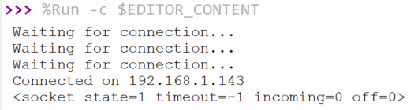

## Open a socket

In this step, you will use the connection to your WLAN to open a socket.

{:width="300px"}

A socket is the way a **server** can listen for a **client** that wants to connect to it. The webpage you are currently looking at is hosted on Raspberry Pi Foundation servers. These servers have an open socket that waits for your web browser to make a connection, at which point the contents of the webpage are sent to your computer. In this case, your server is going to be your Raspberry Pi Pico W and the client will be a web browser on another computer.

To open a socket, you need to provide the IP address and a port number. Port numbers are used by computers to identify where requests should be sent. For instance, port `80` is normally used for web traffic; Stardew Valley uses port `24642` when you're playing a multiplayer game. As you are setting up a web server, you will be using port `80`.

\--- task ---

Create a new function that can be called to open a socket. It should be above your `try`/`except`. Start by giving the socket an IP address and a port number.

## --- code ---

language: python
filename: web_server.py
line_numbers: true
line_number_start: 25
line_highlights:
-------------------------------------

def open_socket(ip):
\# Open a socket
address = (ip, 80)

try:
connect()
except KeyboardInterrupt:
machine.reset()
\--- /code ---

\--- /task ---

\--- task ---

Now create your socket, and then have it listen for requests on port `80`. Don't forget to call your function at the bottom of your code.

## --- code ---

language: python
filename: web_server.py
line_numbers: true
line_number_start: 25
line_highlights: 28-31
-------------------------------------------

def open_socket(ip):
\# Open a socket
address = (ip, 80)
connection = socket.socket()
connection.bind(address)
connection.listen(1)
print(connection)

try:
ip = connect()
open_socket(ip)
except KeyboardInterrupt:
machine.reset()

\--- /code ---

\--- /task ---

\--- task ---

**Test:** Run your code, and you should see an output that looks something like this.

## --- code ---

language: python
filename:
line_numbers: false
line_number_start:
line_highlights:
-------------------------------------

> > > %Run -c $EDITOR_CONTENT
> > > Waiting for connection...
> > > Waiting for connection...
> > > Waiting for connection...
> > > Waiting for connection...
> > > Waiting for connection...
> > > Connected on 192.168.1.143
> > >
> > > <socket state=1 timeout=-1 incoming=0 off=0>

\--- /code ---

`socket state=1` tells you that your socket is working.

\--- /task ---

\--- task ---

Lastly, replace your `print` with a `return` and then store the returned socket connection as a variable.

## --- code ---

language: python
filename: web_server.py
line_numbers: true
line_number_start: 25
line_highlights: 31, 36
--------------------------------------------

def open_socket(ip):
\# Open a socket
address = (ip, 80)
connection = socket.socket()
connection.bind(address)
connection.listen(1)
return connection

try:
ip = connect()
connection = open_socket(ip)
except KeyboardInterrupt:
machine.reset()

\--- /code ---

\--- /task ---

You now have your Raspberry Pi Pico W listening for connections to its IP address on port `80`. This means that it is ready to start serving HTML code, so that a connected web browser can see a webpage.

\--- save ---
