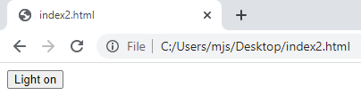

## Créer une page web

Dans cette étape, tu vas créer une page web que le serveur web, exécuté sur ton Raspberry Pi Pico W, peut envoyer à un navigateur web client. Tu vas d'abord tester la page web sur ton ordinateur pour t'assurer qu'elle s'affiche comme il se doit. Dans l'étape suivante, tu peux ajouter le code à ton script Python, afin que ton Raspberry Pi Pico W puisse diffuser la page web.

Une page web peut être aussi simple qu'un texte, formaté de manière à ce qu'un navigateur web la restitue et offre une certaine interactivité. Bien que Thonny ne soit pas conçu pour écrire du HTML, il peut être utilisé à cette fin. Cependant, tu peux utiliser ton éditeur de texte préféré si tu le souhaites, que ce soit VSCode, TextEdit, ou Notepad.

\--- task ---

Dans ton éditeur de texte ou dans Thonny, crée un nouveau fichier. You can call it whatever you like, but `index.html` is the standard name for the first page that a user interacts with. Make sure you add the `.html` file extension. If using Thonny, make sure to save to **This computer**.

\--- /task ---

\--- task ---

There is some standard HTML code that you will need to include to begin with.

## --- code ---

language: html
filename: index.html
line_numbers: true
line_number_start:
line_highlights:
-----------------------------------------------------

<!DOCTYPE html>

<html>
<body>
</body>
</html>

\--- /code ---

\--- /task ---

\--- task ---

Next, you can create a button that will be used to turn the onboard LED on or off.

## --- code ---

language: html
filename: index.html
line_numbers: true
line_number_start:
line_highlights: 4-6
---------------------------------------------------------

<!DOCTYPE html>

<html>
<body>
<form action="./lighton">
<input type="submit" value="Light on" />
</form>
</body>
</html>

\--- /code ---

\--- /task ---

\--- task ---

Save your file and then find it in your file manager. When you double click the file, it should open in your default web browser. Here is what the webpage looks like in Google Chrome.

\--- /task ---

\--- task ---

Add a second button to turn the LED off.

## --- code ---

language: html
filename: index.html
line_numbers: true
line_number_start:
line_highlights: 7-9
---------------------------------------------------------

<!DOCTYPE html>

<html>
<body>
<form action="./lighton">
<input type="submit" value="Light on" />
</form>
<form action="./lightoff">
<input type="submit" value="Light off" />
</form>
</body>
</html>

\--- /code ---

\--- /task ---

\--- task ---

An additional button can be added to close the webserver, without having to use Thonny.

## --- code ---

language: html
filename: index.html
line_numbers: true
line_number_start:
line_highlights: 10-12
-----------------------------------------------------------

<!DOCTYPE html>

<html>
<body>
<form action="./lighton">
<input type="submit" value="Light on" />
</form>
<form action="./lightoff">
<input type="submit" value="Light off" />
</form>
<form action="./close">
<input type="submit" value="Stop server" />
</form>
</body>
</html>

\--- /code ---

\--- /task ---

\--- task ---

To finish off the webpage, you can add in some extra data, such as the state of the LED and the temperature of your Raspberry Pi Pico W.

## --- code ---

language: html
filename: index.html
line_numbers: true
line_number_start:
line_highlights: 13-14
-----------------------------------------------------------

<!DOCTYPE html>

<html>
<body>
<form action="./lighton">
<input type="submit" value="Light on" />
</form>
<form action="./lightoff">
<input type="submit" value="Light off" />
</form>
<form action="./close">
<input type="submit" value="Stop server" />
</form>

LED is {state}

Temperature is {temperature}

</body>
</html>

\--- /code ---

Your webpage should look like this:

\--- /task ---

Now that you have a working webpage, you can add this code into your Python script. You'll need to switch back to your Python code in Thonny first.

\--- task ---

Create a new function called `webpage`, that has two parameters. These are `temperature` and `state`.

## --- code ---

language: python
filename: web_server.py
line_numbers: true
line_number_start: 44
line_highlights:
-----------------------------------------------------

def webpage(temperature, state):
\#Template HTML

\--- /code ---

\--- /task ---

\--- task ---

You can now store all your HTML code that you have written and tested in a variable. Using **fstrings** for the text means that the placeholders you have in the HTML for `temperature` and `state` can be inserted into your string.

## --- code ---

language: python
filename: web_server.py
line_numbers: true
line_number_start: 44
line_highlights: 46-62
-----------------------------------------------------------

def webpage(temperature, state):
\#Template HTML
html = f"""<!DOCTYPE html><html>
<form action="./lighton">
<input type="submit" value="Light on" />
</form>
<form action="./lightoff">
<input type="submit" value="Light off" />
</form>
<form action="./close">
<input type="submit" value="Stop server" />
</form>

LED is {state}

Temperature is {temperature}

</body>
</html>
            """

\--- /code ---

\--- /task ---

\--- task ---

Lastly, you can return the `html` string from your function.

## --- code ---

language: python
filename: web_server.py
line_numbers: true
line_number_start: 44
line_highlights: 63
--------------------------------------------------------

def webpage(temperature, state):
\#Template HTML
html = f"""<!DOCTYPE html><html>
<form action="./lighton">
<input type="submit" value="Light on" />
</form>
<form action="./lightoff">
<input type="submit" value="Light off" />
</form>

LED is {state}

Temperature is {temperature}

</body>
</html>
            """
    return str(html)

\--- /code ---

\--- /task ---

\--- save ---

You can't test this code yet, as your program is not yet serving the HTML. That will be tackled in the next step.

The simple HTML code you have just written will be stored in your MicroPython script and served to the browser of any computers that connect to it over your network, just like a webpage stored on any other server in the world. An important difference is that only devices connected to your WiFi network can access the webpage or control your Raspberry Pi Pico W. This page is a very simple demonstration of what is possible. To learn more about HTML coding and creating websites, see some of our [other projects on this site!](https://projects.raspberrypi.org/en/collections/html_and_css)
