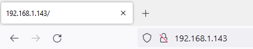

## Servir ta page Web

<div style="display: flex; flex-wrap: wrap">
<div style="flex-basis: 200px; flex-grow: 1; margin-right: 15px;">
Dans cette étape, tu vas démarrer ton serveur Web afin qu'un client puisse s'y connecter, contrôler ta LED et lire la température.
</div>
<div>

</div>
</div>

\--- task ---

Crée une fonction qui démarrera ton serveur web, en utilisant l'objet `connexion` que tu as enregistré en tant que paramètre. Les variables `etat` et `temperature` doivent être définies pour tes données HTML. L'état va commencer comme étant défini à `'OFF'`, et la température à `0`, ce qui signifie que tu dois également t'assurer que la LED est éteinte au démarrage du serveur.

## --- code ---

language: python
filename: web_server.py
line_numbers: true
line_number_start: 66
line_highlights:
-----------------------------------------------------

def serve(connexion):
\#Démarrer un serveur web
etat = 'OFF'
pico_led.off()
temperature = 0

\--- /code ---

\--- /task ---

Lorsque ton navigateur web demande une connexion à ton Raspberry Pi Pico W, la connexion doit être acceptée. Après cela, les données envoyées depuis ton navigateur web doivent être effectuées en blocs spécifiques (dans ce cas, 1024 octets). Tu dois également savoir quelle demande ton navigateur Web effectue : demande-t-il simplement une page simple ? Est-ce qu'il demande une page qui n'existe pas ?

\--- task ---

Tu souhaites que le serveur Web reste opérationnel et à l'écoute en permanence, afin que n'importe quel client puisse s'y connecter. Tu peux le faire en ajoutant une boucle `while True:`. Ajoute ces cinq lignes de code pour que tu puisses accepter une requête, et `print()` pour voir quelle était la requête. Ajoute un appel à ta fonction `serve` dans tes appels en bas de ton code.

## --- code ---

language: python
filename: web_server.py
line_numbers: true
line_number_start: 66
line_highlights: 71-76, 81
---------------------------------------------------------------

def serve(connexion):
\#Démarrer un serveur Web
etat = 'OFF'
pico_led.off()
temperature = 0
while True:
client = connexion.accept()[0]
request = client.recv(1024)
request = str(request)
print(request)
client.close()

ip = connect()
connection = open_socket(ip)
serve(connection)

\--- /code ---

\--- /task ---

**Test :** exécute ton programme, puis tape l’adresse IP dans la barre d’adresse d’un navigateur web sur ton ordinateur.



Tu devrais voir quelque chose comme ça dans la sortie du shell dans Thonny.

```python
>>> %Run -c $EDITOR_CONTENT
Waiting for connection...
Waiting for connection...
Waiting for connection...
Connected on 192.168.1.143
b'GET / HTTP/1.1\r\nHost: 192.168.1.143\r\nUser-Agent: Mozilla/5.0 (Windows NT 10.0; Win64; x64; rv:101.0) Gecko/20100101 Firefox/101.0\r\nAccept: text/html,application/xhtml+xml,application/xml;q=0.9,image/avif,image/webp,*/*;q=0.8\r\nAccept-Language: en-GB,en;q=0.5\r\nAccept-Encoding: gzip, deflate\r\nConnection: keep-alive\r\nUpgrade-Insecure-Requests: 1\r\n\r\n'
b'GET /favicon.ico HTTP/1.1\r\nHost: 192.168.1.143\r\nUser-Agent: Mozilla/5.0 (Windows NT 10.0; Win64; x64; rv:101.0) Gecko/20100101 Firefox/101.0\r\nAccept: image/avif,image/webp,*/*\r\nAccept-Language: en-GB,en;q=0.5\r\nAccept-Encoding: gzip, deflate\r\nConnection: keep-alive\r\nReferer: http://192.168.1.143/\r\n\r\n'
```

\--- task ---

Ensuite, tu dois envoyer le code HTML que tu as écrit dans le navigateur web du client.

## --- code ---

language: python
filename: web_server.py
line_numbers: true
line_number_start: 66
line_highlights: 76, 77
------------------------------------------------------------

def serve(connexion):
\#Démarrer un serveur Web
etat = 'ON'
pico_led.on()
temperature = 0
while True:
client = connexion.accept()[0]
request = client.recv(1024)
request = str(request)
print(request)
html = pageweb(temperature, etat)
client.send(html)
client.close()

ip = connect()
connection = open_socket(ip)
serve(connection)

\--- /code ---

\--- /task ---

\--- task ---

Actualise ta page lorsque tu as exécuté à nouveau le code. Clique sur les boutons qui s'affichent. Dans Thonny, tu devrais alors voir qu'il y a deux sorties différentes de ton shell.

```python
b'GET /lighton? HTTP/1.1\r\nHost: 192.168.1.143\r\nUser-Agent: Mozilla/5.0 (Windows NT 10.0; Win64; x64; rv:101.0) Gecko/20100101 Firefox/101.0\r\nAccept: text/html,application/xhtml+xml,application/xml;q=0.9,image/avif,image/webp,*/*;q=0.8\r\nAccept-Language: en-GB,en;q=0.5\r\nAccept-Encoding: gzip, deflate\r\nConnection: keep-alive\r\nReferer: http://192.168.1.143/\r\nUpgrade-Insecure-Requests: 1\r\n\r\n'
```

et

```python
b'GET /lightoff? HTTP/1.1\r\nHost: 192.168.1.143\r\nUser-Agent: Mozilla/5.0 (Windows NT 10.0; Win64; x64; rv:101.0) Gecko/20100101 Firefox/101.0\r\nAccept: text/html,application/xhtml+xml,application/xml;q=0.9,image/avif,image/webp,*/*;q=0.8\r\nAccept-Language: en-GB,en;q=0.5\r\nAccept-Encoding: gzip, deflate\r\nConnection: keep-alive\r\nReferer: http://192.168.1.143/lighton?\r\nUpgrade-Insecure-Requests: 1\r\n\r\n'
```

\--- /task ---

Note que tu as `/lighton?`, `lightoff?` et `close?` dans les requêtes. Celles-ci peuvent être utilisées pour contrôler la LED embarquée de ton Raspberry Pi Pico W et fermer ton serveur.

\--- task ---

Split the request string and then fetch the first item in the list. Sometimes the request string might not be able to be split, so it's best to handle this in a `try`/`except`.

If the first item in the split is `lighton?` then you can switch the LED on. If it is `lightoff?` then you can switch the LED off. If it is `close?` you can perform a `sys.exit()`

## --- code ---

language: python
filename: web_server.py
line_numbers: true
line_number_start: 66
line_highlights: 75-85
-----------------------------------------------------------

def serve(connection):
\#Start a web server
state = 'ON'
pico_led.on()
temperature = 0
while True:
client = connection.accept()[0]
request = client.recv(1024)
request = str(request)
try:
request = request.split()[1]
except IndexError:
pass
if request == '/lighton?':
pico_led.on()
elif request =='/lightoff?':
pico_led.off()
elif request == '/close?':
sys.exit()\
html = webpage(temperature, state)
client.send(html)
client.close()

\--- /code ---

\--- /task ---

\--- task ---

Run your code again. This time, when you refresh your browser window and click on the buttons, the onboard LED should turn on and off. If you click on the **Stop Server** button, your server should shutdown.

\--- /task ---

\--- task ---

You can also tell the user of the webpage what the state of the LED is.

## --- code ---

language: python
filename: web_server.py
line_numbers: true
line_number_start: 66
line_highlights: 81, 84
------------------------------------------------------------

def serve(connection):
\#Start a web server
state = 'ON'
pico_led.on()
temperature = 0
while True:
client = connection.accept()[0]
request = client.recv(1024)
request = str(request)
try:
request = request.split()[1]
except IndexError:
pass
if request == '/lighton?':
pico_led.on()
state = 'ON'
elif request =='/lightoff?':
pico_led.off()
state = 'OFF'
elif request == '/close?':
sys.exit()
html = webpage(temperature, state)
client.send(html)
client.close()

\--- /code ---

Now when you run the code, the text for the state of the LED should also change on the refreshed webpage.

\--- /task ---

\--- task ---

Lastly, you can use the onboard temperature sensor to get an approximate reading of the CPU temperature, and display that on your webpage as well.

## --- code ---

language: python
filename: web_server.py
line_numbers: true
line_number_start: 66
line_highlights: 87
--------------------------------------------------------

def serve(connection):
\#Start a web server
state = 'ON'
pico_led.on()
temperature = 0
while True:
client = connection.accept()[0]
request = client.recv(1024)
request = str(request)
try:
request = request.split()[1]
except IndexError:
pass
if request == '/lighton?':
pico_led.on()
state = 'ON'
elif request =='/lightoff?':
pico_led.off()
state = 'OFF'
elif request == '/close?':
sys.exit()
temperature = pico_temp_sensor.temp
html = webpage(temperature, state)
client.send(html)
client.close()

\--- /code ---

\--- /task ---

\--- task ---

**Test:** You can hold your hand over your Raspberry Pi Pico W to increase its temperature, then refresh the webpage on your computer to see the new value that is displayed.

\--- /task ---
