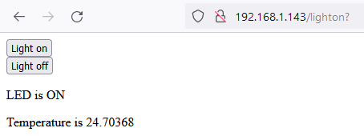

## Servir ta page Web

<div style="display: flex; flex-wrap: wrap">
<div style="flex-basis: 200px; flex-grow: 1; margin-right: 15px;">
Dans cette étape, tu vas démarrer ton serveur web afin qu'un client puisse s'y connecter, contrôler ta LED et lire la température.
</div>
<div>

</div>
</div>

\--- task ---

Crée une fonction qui démarrera ton serveur web, en utilisant l'objet `connexion` que tu as enregistré en tant que paramètre. Les variables `etat` et `temperature` doivent être définies pour tes données HTML. L'état va commencer comme étant défini sur `'OFF'`, et la température à `0`, ce qui signifie que tu dois également t'assurer que la LED est éteinte au démarrage du serveur.

## --- code ---

language: python
filename: web_server.py
line_numbers: true
line_number_start: 66
line_highlights:
-----------------------------------------------------

def serve(connexion):
\#Démarrer un serveur web
etat = 'OFF'
pico_led.off()
temperature = 0

\--- /code ---

\--- /task ---

Lorsque ton navigateur web demande une connexion à ton Raspberry Pi Pico W, la connexion doit être acceptée. Après cela, les données envoyées depuis ton navigateur web doivent être effectuées en blocs spécifiques (dans ce cas, 1024 octets). Tu dois également savoir quelle est la requête de ton navigateur web : demande-t-il une simple page ? Est-ce qu'il demande une page qui n'existe pas ?

\--- task ---

Tu souhaites que le serveur web reste opérationnel et à l'écoute en permanence, afin que n'importe quel client puisse s'y connecter. Tu peux le faire en ajoutant une boucle `while True:`. Ajoute ces cinq lignes de code pour que tu puisses accepter une requête, et `print()` pour voir quelle était la requête. Ajoute un appel à ta fonction `serve` dans tes appels en bas de ton code.

## --- code ---

language: python
filename: web_server.py
line_numbers: true
line_number_start: 66
line_highlights: 71-76, 81
---------------------------------------------------------------

def serve(connexion):
\#Démarrer un serveur web
etat = 'OFF'
pico_led.off()
temperature = 0
while True:
client = connexion.accept()[0]
requete = client.recv(1024)
requete = str(requete)
print(requete)
client.close()

ip = connect()
connection = open_socket(ip)
serve(connection)

\--- /code ---

\--- /task ---

**Test :** exécute ton programme, puis tape l’adresse IP dans la barre d’adresse d’un navigateur web sur ton ordinateur.


Tu devrais voir quelque chose comme ça dans la sortie du shell dans Thonny.

```python
>>> %Run -c $EDITOR_CONTENT
Waiting for connection...
Waiting for connection...
Waiting for connection...
Connected on 192.168.1.143
b'GET / HTTP/1.1\r\nHost: 192.168.1.143\r\nUser-Agent: Mozilla/5.0 (Windows NT 10.0; Win64; x64; rv:101.0) Gecko/20100101 Firefox/101.0\r\nAccept: text/html,application/xhtml+xml,application/xml;q=0.9,image/avif,image/webp,*/*;q=0.8\r\nAccept-Language: en-GB,en;q=0.5\r\nAccept-Encoding: gzip, deflate\r\nConnection: keep-alive\r\nUpgrade-Insecure-Requests: 1\r\n\r\n'
b'GET /favicon.ico HTTP/1.1\r\nHost: 192.168.1.143\r\nUser-Agent: Mozilla/5.0 (Windows NT 10.0; Win64; x64; rv:101.0) Gecko/20100101 Firefox/101.0\r\nAccept: image/avif,image/webp,*/*\r\nAccept-Language: en-GB,en;q=0.5\r\nAccept-Encoding: gzip, deflate\r\nConnection: keep-alive\r\nReferer: http://192.168.1.143/\r\n\r\n'
```

\--- task ---

Ensuite, tu dois envoyer le code HTML que tu as écrit dans le navigateur web du client.

## --- code ---

language: python
filename: web_server.py
line_numbers: true
line_number_start: 66
line_highlights: 76, 77
------------------------------------------------------------

def serve(connexion):
\#Démarrer un serveur Web
etat = 'ON'
pico_led.on()
temperature = 0
while True:
client = connexion.accept()[0]
requete = client.recv(1024)
requete = str(requete)
print(requete)
html = pageweb(temperature, etat)
client.send(html)
client.close()

ip = connect()
connection = open_socket(ip)
serve(connection)

\--- /code ---

\--- /task ---

\--- task ---

Actualise ta page lorsque tu as exécuté à nouveau le code. Clique sur les boutons qui s'affichent. Dans Thonny, tu devrais alors voir qu'il y a deux sorties différentes de ton shell.

```python
b'GET /lighton? HTTP/1.1\r\nHost: 192.168.1.143\r\nUser-Agent: Mozilla/5.0 (Windows NT 10.0; Win64; x64; rv:101.0) Gecko/20100101 Firefox/101.0\r\nAccept: text/html,application/xhtml+xml,application/xml;q=0.9,image/avif,image/webp,*/*;q=0.8\r\nAccept-Language: en-GB,en;q=0.5\r\nAccept-Encoding: gzip, deflate\r\nConnection: keep-alive\r\nReferer: http://192.168.1.143/\r\nUpgrade-Insecure-Requests: 1\r\n\r\n'
```

et

```python
b'GET /lightoff? HTTP/1.1\r\nHost: 192.168.1.143\r\nUser-Agent: Mozilla/5.0 (Windows NT 10.0; Win64; x64; rv:101.0) Gecko/20100101 Firefox/101.0\r\nAccept: text/html,application/xhtml+xml,application/xml;q=0.9,image/avif,image/webp,*/*;q=0.8\r\nAccept-Language: en-GB,en;q=0.5\r\nAccept-Encoding: gzip, deflate\r\nConnection: keep-alive\r\nReferer: http://192.168.1.143/lighton?\r\nUpgrade-Insecure-Requests: 1\r\n\r\n'
```

\--- /task ---

Note que tu as `/lighton?`, `lightoff?` et `close?` dans les requêtes. Celles-ci peuvent être utilisées pour contrôler la LED intégrée de ton Raspberry Pi Pico W et fermer ton serveur.

\--- task ---

Divise la chaîne de requête, puis récupère le premier élément de la liste. Parfois, la chaîne de requête peut ne pas pouvoir être divisée, il est donc préférable de la gérer dans une `try`/`except`.

Si le premier élément de la division est `lighton?` alors tu peux allumer la LED. Si c'est `lightoff?` alors tu peux éteindre la LED. Si c'est `close?` tu peux effectuer un `sys.exit()`

## --- code ---

language: python
filename: web_server.py
line_numbers: true
line_number_start: 66
line_highlights: 75-85
-----------------------------------------------------------

def serve(connexion):
\#Démarrer un serveur web
etat = 'ON'
pico_led.on()
temperature = 0
while True:
client = connexion.accept()[0]
requete = client.recv(1024)
requete = str(requete)
try:
requete = requete.split()[1]
except IndexError:
pass
if requete == '/lighton?':
pico_led.on()
elif requete =='/lightoff?':
pico_led.off()
elif requete== '/close?':
sys.exit()\
html = pageweb(temperature, etat)
client.send(html)
client.close()

\--- /code ---

\--- /task ---

\--- task ---

Exécute ton code à nouveau. Cette fois, lorsque tu actualises la fenêtre de ton navigateur et clique sur les boutons, la LED intégrée doit s'allumer et s'éteindre. Si tu cliques sur le bouton **Arrêter le serveur**, ton serveur devrait s'arrêter.

\--- /task ---

\--- task ---

Tu peux également dire à l'utilisateur de la page web quel est l'état de la LED.

## --- code ---

language: python
filename: web_server.py
line_numbers: true
line_number_start: 66
line_highlights: 81, 84
------------------------------------------------------------

def serve(connexion):
\#Démarrer un serveur web
etat = 'ON'
pico_led.on()
temperature = 0
while True:
client = connexion.accept()[0]
requete = client.recv(1024)
requete = str(requete)
try:
requete = requete.split()[1]
except IndexError:
pass
if requete == '/lighton?':
pico_led.on()
etat = 'ON'
elif requete=='/lightoff?':
pico_led.off()
etat = 'OFF'
elif requete== '/close?':
sys.exit()
html = pageweb(temperature, etat)
client.send(html)
client.close()

\--- /code ---

Maintenant, lorsque tu exécutes le code, le texte de l'état de la LED devrait également changer sur la page web actualisée.

\--- /task ---

\--- task ---

Enfin, tu peux utiliser le capteur de température intégré pour obtenir une lecture approximative de la température du processeur et l'afficher également sur ta page web.

## --- code ---

language: python
filename: web_server.py
line_numbers: true
line_number_start: 66
line_highlights: 87
--------------------------------------------------------

def serve(connexion):
\#Démarrer un serveur web
etat = 'ON'
pico_led.on()
temperature = 0
while True:
client = connexion.accept()[0]
requete = client.recv(1024)
requete = str(requete)
try:
requete = requete.split()[1]
except IndexError:
pass
if requete == '/lighton?':
pico_led.on()
etat = 'ON'
elif requete=='/lightoff?':
pico_led.off()
etat = 'OFF'
elif requete== '/close?':
sys.exit()
temperature = pico_temp_sensor.temp
html = pageweb(temperature, etat)
client.send(html)
client.close()

\--- /code ---

\--- /task ---

\--- task ---

**Test :** tu peux passer ta main au-dessus de ton Raspberry Pi Pico W pour augmenter sa température, puis rafraîchir la page web sur ton ordinateur pour voir la nouvelle valeur affichée.

\--- /task ---
