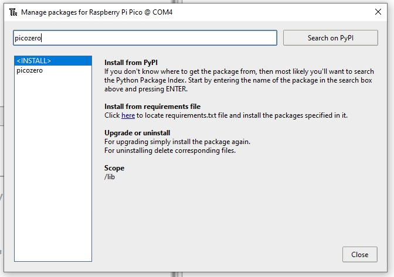

## Stel je Raspberry Pi Pico W in

Sluit je Raspberry Pi Pico W aan en stel MicroPython in.

MicroPython is een versie van de programmeertaal Python voor microcontrollers, zoals je Raspberry Pi Pico W. Met MicroPython kun je jouw Python-kennis gebruiken om code te schrijven voor interactie met elektronische componenten.

\--- task ---

Download de nieuwste versie van de Raspberry Pi Pico W-firmware op [https://rpf.io/pico-w-firmware](https://rpf.io/pico-w-firmware)

\--- /task ---

\--- task ---

**Sluit** het kleine uiteinde van je micro-USB-kabel aan op de Raspberry Pi Pico W.

\--- /task ---

\--- task ---

Houd de **BOOTSEL**-knop op je Raspberry Pi Pico W ingedrukt.

\--- /task ---

\--- task ---

**Verbind** het andere uiteinde met je desktop computer, laptop of Raspberry Pi.

\--- /task ---

\--- task ---

Je bestandsbeheerder zou nu moeten openen en de Raspberry Pi Pico zou moeten worden weergegeven als een extern aangesloten schijf. Sleep het gedownloade firmwarebestand naar de bestandsbeheerder. De verbinding met je Raspberry Pi Pico wordt verbroken en de bestandsbeheerder wordt gesloten.

\--- /task ---

\--- task ---

Open de Thonny editor.

\--- /task ---

\--- task ---

Kijk naar de tekst in de rechterbenedenhoek van de Thonny editor. Het zal je de versie van Python laten zien die wordt gebruikt.

Als er **niet** 'MicroPython (Raspberry Pi Pico)' staat, klik dan op de tekst en selecteer 'MicroPython (Raspberry Pi Pico)' uit de opties.

\--- /task ---

\--- task ---

**Fouten oplossen:**

## --- collapse ---

## title: Ik weet niet of de firmware is geïnstalleerd en ik kan geen verbinding kan maken met mijn Pico

Zorg ervoor dat je Raspberry Pi Pico W met een micro-USB-kabel op je computer is aangesloten. Klik op de lijst in de rechterbenedenhoek van het Thonny-venster. Er verschijnt een pop-up menu met de beschikbare interpreters.

Als je Pico niet in de lijst ziet (zoals in de afbeelding), moet je de Raspberry Pi Pico W opnieuw verbinden terwijl je de BOOTSEL-knop ingedrukt houdt om het als een opslagvolume te koppelen en daarna de firmware opnieuw installeren door de instructies in het bovenstaande gedeelte te volgen.

\--- /collapse ---

## --- collapse ---

## title: Firmware is geïnstalleerd, maar ik kan nog steeds geen verbinding maken met mijn Pico

Mogelijk gebruik je de verkeerde micro-USB-kabel. Je huidige micro-USB-kabel is mogelijk beschadigd of alleen ontworpen om stroom naar apparaten over te brengen en niet om gegevens over te brengen. Probeer de kabel te vervangen door een andere als verder niets heeft gewerkt.

Als je Pico nog steeds geen verbinding kan maken nadat je al deze dingen hebt geprobeerd, kan het **zelf** beschadigd zijn en niet in staat zijn verbinding te maken.

\--- /collapse ---

\--- /task ---

Voor beginners met Raspberry Pi Pico is `picozero` een MicroPython-bibliotheek die speciaal is ontwikkeld voor beginners.

\--- task ---

Om de projecten in dit pad te voltooien, moet je de `picozero` bibliotheek installeren als een Thonny-pakket.

In Thonny, kies **Tools** > **Manage packages**.

\--- /task ---

\--- task ---

In het pop-up 'Manage packages for Raspberry Pi Pico' venster, type `picozero` en klik **Search on PyPi**.

\--- /task ---

\--- task ---

Klik op **picozero** in de zoekresultaten.

Klik op **Install**.

Wanneer de installatie is voltooid, sluit je het package venster, vervolgens sluit je Thonny af en dan open je Thonny opnieuw.

\--- /task ---

Als je problemen hebt met het installeren van de `picozero` bibliotheek in Thonny, kun je het bibliotheekbestand downloaden en opslaan op je Raspberry Pi Pico.

[[[picozero-offline-install]]]
