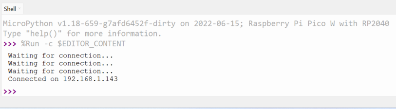

## Verbind je Raspberry Pi Pico W met een WLAN

Hier leer je hoe je MicroPython kunt gebruiken om je Raspberry Pi Pico W te verbinden met een draadloos lokaal netwerk (WLAN), beter bekend als een WiFi-netwerk.

{:width="300px"}

Wachtwoorden moeten veilig en privé worden bewaard. In deze stap voeg je je WiFi-wachtwoord toe aan je Python-bestand. Zorg ervoor dat je jouw bestand niet deelt met iemand aan wie je jouw wachtwoord niet wilt geven.

Om verbinding te maken met een WiFi-netwerk, moet je jouw service set identifier (SSID) weten. Dat is de naam van jouw WiFi-netwerk. Je hebt ook jouw WiFi-wachtwoord nodig. Deze wachtwoorden staan meestal op je draadloze router, maar je zou het standaardwachtwoord moeten hebben gewijzigd in iets unieks.

\--- task ---

Importeer in Thonny de pakketten die je nodig hebt om verbinding te maken met jouw wifi-netwerk, de ingebouwde temperatuursensor uit te lezen en de ingebouwde lichtgevende diode (LED) te laten branden.

## --- code ---

language: python
filename: web_server.py
line_numbers: true
line_number_start:
line_highlights:
-----------------------------------------------------

import network
import socket
from time import sleep
from picozero import pico_temp_sensor, pico_led
import machine
import rp2
import sys

\--- /code ---

Sla deze code nu op en kies de optie om op te slaan op **This computer**

\--- /task ---

\--- task ---

Stel vervolgens je Raspberry Pi Pico W in om de ingebouwde LED te gebruiken en voeg daarnaast de SSID en het wachtwoord voor jouw netwerk toe.

## --- code ---

language: python
filename: web_server.py
line_numbers: true
line_number_start: 9
line_highlights:
-----------------------------------------------------

ssid = 'NAAM VAN JOUW WIFI-NETWERK'
wachtwoord = 'JOUW GEHEIME WACHTWOORD'

\--- /code ---

\--- /task ---

\--- task ---

Begin nu met het bouwen van een functie om verbinding te maken met jouw WLAN. Je moet een `wlan`-object instellen, de draadloze verbinding activeren en het object voorzien van jouw `ssid` en `wachtwoord`.

## --- code ---

language: python
filename: web_server.py
line_numbers: true
line_number_start: 14
line_highlights:
-----------------------------------------------------

def connect():
\#Verbind met WLAN
wlan = network.WLAN(network.STA_IF)
wlan.active(True)
wlan.connect(ssid, wachtwoord)

\--- /code ---

\--- /task ---

\--- task ---

Als je eerder een apparaat met een WiFi-netwerk hebt verbonden, weet je dat dit niet onmiddelijk gebeurt. Je apparaat stuurt verzoeken naar jouw WiFi-router om verbinding te maken, wanneer de router reageert, wordt er een handshake uitgevoerd om de verbinding tot stand te brengen. Om dit met Python te doen, kun je een lus instellen die elke seconde verzoeken blijft versturen totdat de verbindingshandshake is uitgevoerd.

## --- code ---

language: python
filename: web_server.py
line_numbers: true
line_number_start: 14
line_highlights: 19-21
-----------------------------------------------------------

def connect():
\#Verbinding maken met WLAN
wlan = network.WLAN(network.STA_IF)
wlan.active(True)
wlan.connect(ssid, wachtwoord)
while wlan.isconnected() == False:
print('Wachten op verbinding...')
sleep(1)

\--- /code ---

\--- /task ---

\--- task ---

Print nu jouw WLAN-configuratie uit en test alles. Je moet je functie aanroepen. Plaats alle functieaanroepen onderaan je bestand, zodat ze de laatste regels code zijn die worden uitgevoerd.

## --- code ---

language: python
filename: web_server.py
line_numbers: true
line_number_start: 14
line_highlights: 25, 22
------------------------------------------------------------

def connect():
\#Verbinding maken met WLAN
wlan = network.WLAN(network.STA_IF)
wlan.active(True)
wlan.connect(ssid, wachtwoord)
while wlan.isconnected() == False:
print('Wachten op verbinding...')
sleep(1)
print(wlan.ifconfig())

connect()

\--- /code ---

\--- /task ---

\--- task ---

**Test:** Sla je code op en voer je code uit. Je zou in de shell uitvoer moeten zien die er ongeveer zo uitziet, hoewel de specifieke IP-adressen anders zullen zijn.

## --- code ---

language: python
filename:
line_numbers: false
line_number_start:
line_highlights:
-----------------------------------------------------

Waiting for connection...
Waiting for connection...
Waiting for connection...
Wachten op verbinding...
Waiting for connection...
('192.168.1.143', '255.255.255.0', '192.168.1.254', '192.168.1.254')

\--- /code ---

\--- /task ---

\--- collapse ---

---

## title: De Raspberry Pi Pico W maakt geen verbinding

1. Zorg ervoor dat je de juiste SSID en het juiste wachtwoord gebruikt.
2. Als je gebruikmaakt van een school- of werk-WLAN, is het mogelijk dat ongeautoriseerde apparaten geen toegang tot het WiFi-netwerk krijgen.
3. Koppel jouw Raspberry Pi Pico W los van je computer om hem uit te schakelen en sluit hem vervolgens weer aan. Dit kan een probleem zijn als je eenmaal verbinding hebt gemaakt en het vervolgens opnieuw probeert.

\--- /collapse ---

\--- task ---

Je hebt niet alle informatie nodig die `wlan.ifconfig()` biedt. De belangrijkste informatie die je nodig hebt, is het IP-adres van de Raspberry Pi Pico W, dit is het eerste stukje informatie. Je kunt een **fstring** gebruiken om het **IP-adres** uit te voeren. Door een `f` voor je tekenreeks te plaatsen, kunnen variabelen worden afgedrukt wanneer ze worden geplaatst tussen `{}`.

## --- code ---

language: python
filename: web_server.py
line_numbers: true
line_number_start: 14
line_highlights: 22, 23
------------------------------------------------------------

def connect():
\#Verbinding maken met WLAN
wlan = network.WLAN(network.STA_IF)
wlan.active(True)
wlan.connect(ssid, wachtwoord)
while wlan.isconnected() == False:
print('Wachten op verbinding...')
sleep(1)
ip = wlan.ifconfig()[0]
print(f'Connected on {ip}')

connect()

\--- /code ---

\--- /task ---

\--- task ---

Je kunt nu de waarde voor het IP-adres van jouw Raspberry Pi Pico W retourneren en opslaan wanneer je jouw functie aanroept.

## --- code ---

language: python
filename: web_server.py
line_numbers: true
line_number_start: 14
line_highlights: 23, 26
------------------------------------------------------------

def connect():
\#Verbinding maken met WLAN
wlan = network.WLAN(network.STA_IF)
wlan.active(True)
wlan.connect(ssid, wachtwoord)
while wlan.isconnected() == False:
print('Wachten op verbinding...')
sleep(1)
print(f'Verbonden op {ip}')
return ip

ip = connect()

\--- /code ---

\--- /task ---

Het is mogelijk dat je dit bestand wilt uitvoeren zonder Thonny te gebruiken, dit wordt later in dit project besproken. Het zou handig zijn als er een indicatie zou zijn dat de Raspberry Pi Pico verbinding heeft gemaakt met het WLAN en dat het programma afgesloten zou kunnen worden zonder dat de Raspberry Pi Pico verbonden hoeft te zijn met een computer.

\--- task ---

Voeg een voorwaarde toe, waarbij het programma wordt afgesloten als de bootselknop wordt ingedrukt.

## --- code ---

language: python
filename: web_server.py
line_numbers: true
line_number_start: 14
line_highlights: 20, 21
------------------------------------------------------------

def connect():
\#Verbinding maken met WLAN
wlan = network.WLAN(network.STA_IF)
wlan.active(True)
wlan.connect(ssid, wachtwoord)
while wlan.isconnected() == False:
if rp2.bootsel_button() == 1:
sys.exit()
print('Wachten op verbinding...')
ip = wlan.ifconfig()[0]
print(f'Verbonden op {ip}')
return ip

\--- /code ---

\--- /task ---

\--- task ---

Zorg er vervolgens voor dat de ingebouwde LED knippert telkens wanneer er geprobeerd wordt verbinding te maken, en dat de LED blijft branden zodra er verbinding is gemaakt.

## --- code ---

language: python
filename: web_server.py
line_numbers: true
line_number_start: 14
line_highlights: 23, 24, 25, 26, 29
------------------------------------------------------------------------

def connect():
\#Verbinding maken met WLAN
wlan = network.WLAN(network.STA_IF)
wlan.active(True)
wlan.connect(ssid, wachtwoord)
while wlan.isconnected() == False:
if rp2.bootsel_button() == 1:
sys.exit()
print('Wachten op verbinding...')
pico_led.on()
sleep(0.5)
pico_led.off()
sleep(0.5)
ip = wlan.ifconfig()[0]
print(f'Verbonden op {ip}')
pico_led.on()
return ip

\--- /code ---

\--- /task ---

\--- save ---
