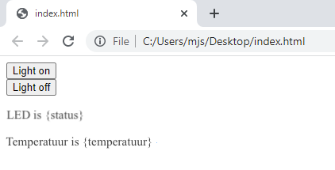
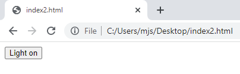
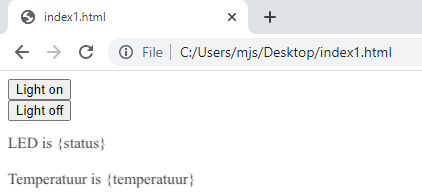

## Maak een webpagina

In deze stap maak je een webpagina die de webserver op je Raspberry Pi Pico W naar een client webbrowser kan sturen. Je gaat de webpagina eerst op jouw computer testen, om er zeker van te zijn dat deze correct wordt weergegeven. In de volgende stap kun je de code toevoegen aan jouw Python-script, zodat jouw Raspberry Pi Pico W de webpagina kan presenteren.

Een webpagina kan bestaan uit wat tekst, die zo is opgemaakt dat een webbrowser de tekst kan weergeven en voor enige interactie kan zorgen. Hoewel Thonny niet ontworpen is om HTML te schrijven, kan het wel voor dit doel gebruikt worden. Je kunt echter ook jouw favoriete teksteditor gebruiken, bijvoorbeeld VSCode, TextEdit of Kladblok.

\--- task ---

Maak een nieuw bestand in je teksteditor of in Thonny. Je kunt het elke gewenste naam geven, maar `index.html` is de standaardnaam voor de eerste pagina waarmee een gebruiker communiceert. Zorg ervoor dat je de bestandsextensie `.html` toevoegt. Als je Thonny gebruikt, zorg er dan voor dat je het bestand op **This computer** opslaat.

\--- /task ---

\--- task ---

Om te beginnen moet je een aantal standaard HTML-codes toevoegen.

## --- code ---

language: html
filename: index.html
line_numbers: true
line_number_start:
line_highlights:
-----------------------------------------------------

<!DOCTYPE html>

<html>
<body>
</body>
</html>

\--- /code ---

\--- /task ---

\--- task ---

Vervolgens kun je een knop maken waarmee je de ingebouwde LED kunt aan- of uitzetten.

## --- code ---

language: html
filename: index.html
line_numbers: true
line_number_start:
line_highlights: 4-6
---------------------------------------------------------

<!DOCTYPE html>

<html>
<body>
<form action="./lighton">
<input type="submit" value="Light on" />
</form>
</body>
</html>

\--- /code ---

\--- /task ---

\--- task ---

Sla je bestand op en zoek het op in jouw bestandsbeheerder. Wanneer je dubbelklikt op het bestand, wordt het geopend in je standaardwebbrowser. Zo ziet de webpagina eruit in Google Chrome.

\--- /task ---

\--- task ---

Voeg een tweede knop toe om de LED uit te schakelen.

## --- code ---

language: html
filename: index.html
line_numbers: true
line_number_start:
line_highlights: 7-9
---------------------------------------------------------

<!DOCTYPE html>

<html>
<body>
<form action="./lighton">
<input type="submit" value="Light on" />
</form>
<form action="./lightoff">
<input type="submit" value="Light off" />
</form>
</body>
</html>

\--- /code ---

\--- /task ---

\--- task ---

Er kan een extra knop worden toegevoegd om de webserver te sluiten, zonder dat Thonny nodig is.

## --- code ---

language: html
filename: index.html
line_numbers: true
line_number_start:
line_highlights: 10-12
-----------------------------------------------------------

<!DOCTYPE html>

<html>
<body>
<form action="./lighton">
<input type="submit" value="Light on" />
</form>
<form action="./lightoff">
<input type="submit" value="Light off" />
</form>
<form action="./close">
<input type="submit" value="Stop server" />
</form>
</body>
</html>

\--- /code ---

\--- /task ---

\--- task ---

Om de webpagina af te ronden, kun je nog wat extra gegevens toevoegen, zoals de status van de LED en de temperatuur van jouw Raspberry Pi Pico W.

## --- code ---

language: html
filename: index.html
line_numbers: true
line_number_start:
line_highlights: 13-14
-----------------------------------------------------------

<!DOCTYPE html>

<html>
<body>
<form action="./lighton">
<input type="submit" value="Light on" />
</form>
<form action="./lightoff">
<input type="submit" value="Light off" />
</form>
<form action="./close">
<input type="submit" value="Stop server" />
</form>

LED is {status}

Temperatuur is {temperatuur}

</body>
</html>

\--- /code ---

Je webpagina zou er als volgt uit moeten zien:

\--- /task ---

Nu je een werkende webpagina hebt, kun je deze code aan jouw Python-script toevoegen. Je moet eerst terugschakelen naar je Python-code in Thonny.

\--- task ---

Maak een nieuwe functie met de naam `webpagina`, die twee parameters heeft. Dit zijn `temperatuur` en `status`.

## --- code ---

language: python
filename: web_server.py
line_numbers: true
line_number_start: 44
line_highlights:
-----------------------------------------------------

def webpagina(temperatuur, status):
\#HTML-sjabloon

\--- /code ---

\--- /task ---

\--- task ---

Nu kun je al jouw HTML-code die je hebt geschreven en getest, opslaan in een variabele. Als je **fstrings** voor de tekst gebruikt, kun je de tijdelijke aanduidingen in de HTML voor `temperatuur` en `status` in jouw tekenreeks invoegen.

## --- code ---

language: python
filename: web_server.py
line_numbers: true
line_number_start: 44
line_highlights: 46-62
-----------------------------------------------------------

def webpagina(temperatuur, status):
\#HTML-sjabloon
html = f"""<!DOCTYPE html><html>
<form action="./lighton">
<input type="submit" value="Light on" />
</form>
<form action="./lightoff">
<input type="submit" value="Light off" />
</form>
<form action="./close">
<input type="submit" value="Stop server" />
</form>

LED is {status}

Temperatuur is {temperatuur}

</body>
</html>
"""

\--- /code ---

\--- /task ---

\--- task ---

Ten slotte kun je de `html`-string uit jouw functie retourneren.

## --- code ---

language: python
filename: web_server.py
line_numbers: true
line_number_start: 44
line_highlights: 63
--------------------------------------------------------

def webpagina(temperatuur, status):
\#HTML-sjabloon
html = f"""<!DOCTYPE html><html>
<form action="./lighton">
<input type="submit" value="Light on" />
</form>
<form action="./lightoff">
<input type="submit" value="Light off" />
</form>

LED is {status}

Temperatuur is {temperatuur}

</body>
</html>
            """
    return str(html)

\--- /code ---

\--- /task ---

\--- save ---

Je kunt deze code nog niet testen, omdat jouw programma de HTML nog niet bedient. Dat wordt in de volgende stap aangepakt.

De eenvoudige HTML-code die je zojuist hebt geschreven, wordt opgeslagen in jouw MicroPython-script en weergegeven in de browser van alle computers die via jouw netwerk verbinding maken met het script, net als een webpagina die op een andere server ter wereld is opgeslagen. Een belangrijk verschil is dat alleen apparaten die zijn verbonden met jouw WiFi-netwerk toegang hebben tot de webpagina of jouw Raspberry Pi Pico W kunnen bedienen. Deze pagina is een zeer eenvoudige demonstratie van wat mogelijk is. Om meer te leren over HTML-codering en het maken van websites, bekijk enkele van onze [andere projecten op deze site!](https://projects.raspberrypi.org/en/collections/html_and_css)

