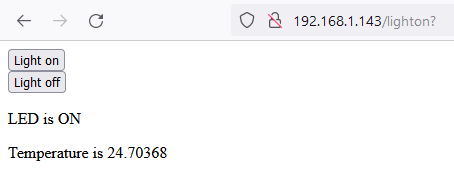
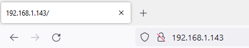

## Bedien je webpagina

<div style="display: flex; flex-wrap: wrap">
<div style="flex-basis: 200px; flex-grow: 1; margin-right: 15px;">
In deze stap start je jouw webserver op, zodat een client er verbinding mee kan maken, jouw LED kan bedienen en de temperatuur kan aflezen.
</div>
<div>

</div>
</div>

\--- task ---

Maak een functie die jouw webserver start, met behulp van het `verbinding`-object dat je als parameter hebt opgeslagen. De variabelen `status` en `temperatuur` moeten worden ingevuld voor jouw HTML-gegevens. De status staat in eerste instantie op `UIT` en de temperatuur op `0`. Dit betekent dat je er ook voor moet zorgen dat de LED uit is wanneer de server start.

## --- code ---

language: python
filename: web_server.py
line_numbers: true
line_number_start: 66
line_highlights:
-----------------------------------------------------

def serve(verbinding):
\#Start een webserver
status = 'UIT'
pico_led.off()
temperatuur = 0

\--- /code ---

\--- /task ---

Wanneer je webbrowser vraagt om een verbinding met jouw Raspberry Pi Pico W, moet de verbinding worden geaccepteerd. Daarna moeten de gegevens die door je webbrowser worden verzonden, in specifieke stukken worden verdeeld (in dit geval 1024 bytes). Je moet ook weten welk verzoek je webbrowser doet: vraagt hij om een eenvoudige pagina? Vraagt het om een pagina die niet bestaat?

\--- task ---

Je wilt dat de webserver altijd actief is en luistert, zodat elke client er verbinding mee kan maken. Je kunt dit doen door een `while True:`-lus toe te voegen. Voeg deze vijf regels code toe zodat je een verzoek kunt accepteren en `print()` om te zien wat het verzoek was. Voeg een aanroep toe aan jouw `serve`-functie in je aanroepen onderaan je code.

## --- code ---

language: python
filename: web_server.py
line_numbers: true
line_number_start: 66
line_highlights: 71-76, 81
---------------------------------------------------------------

def serve(verbinding):
\#Start een webserver
status = 'UIT'
pico_led.off()
temperatuur = 0
while True:
client = verbinding.accept()[0]
verzoek = client.recv(1024)
verzoek = str(verzoek)
print(verzoek)
client.close()

ip = connect()
connection = open_socket(ip)
serve(connection)

\--- /code ---

\--- /task ---

**Test:** Start je programma en typ vervolgens het IP-adres in de adresbalk van een webbrowser op jouw computer.



Je zou zoiets moeten zien in de shell-uitvoer van Thonny.

```python
>>> %Run -c $EDITOR_CONTENT
Waiting for connection...
Waiting for connection...
Waiting for connection...
Connected on 192.168.1.143
b'GET / HTTP/1.1\r\nHost: 192.168.1.143\r\nUser-Agent: Mozilla/5.0 (Windows NT 10.0; Win64; x64; rv:101.0) Gecko/20100101 Firefox/101.0\r\nAccept: text/html,application/xhtml+xml,application/xml;q=0.9,image/avif,image/webp,*/*;q=0.8\r\nAccept-Language: en-GB,en;q=0.5\r\nAccept-Encoding: gzip, deflate\r\nConnection: keep-alive\r\nUpgrade-Insecure-Requests: 1\r\n\r\n'
b'GET /favicon.ico HTTP/1.1\r\nHost: 192.168.1.143\r\nUser-Agent: Mozilla/5.0 (Windows NT 10.0; Win64; x64; rv:101.0) Gecko/20100101 Firefox/101.0\r\nAccept: image/avif,image/webp,*/*\r\nAccept-Language: en-GB,en;q=0.5\r\nAccept-Encoding: gzip, deflate\r\nConnection: keep-alive\r\nReferer: http://192.168.1.143/\r\n\r\n'
```

\--- task ---

Vervolgens moet je de HTML-code die je hebt geschreven naar de webbrowser van de client sturen.

## --- code ---

language: python
filename: web_server.py
line_numbers: true
line_number_start: 66
line_highlights: 76, 77
------------------------------------------------------------

def serve(verbinding):
\#Start een webserver
status = 'AAN'
pico_led.on()
temperatuur = 0
while True:
client = verbinding.accept()[0]
verzoek = client.recv(1024)
verzoek = str(verzoek)
print(verzoek)
html = webpagina(temperatuur, status)
client.send(html)
client.close()

ip = connect()
connection = open_socket(ip)
serve(connection)

\--- /code ---

\--- /task ---

\--- task ---

Vernieuw de pagina wanneer je de code opnieuw hebt uitgevoerd. Klik op de weergegeven knoppen. In Thonny zou je dan twee verschillende uitvoerresultaten van je shell moeten zien.

```python
b'GET /lighton? HTTP/1.1\r\nHost: 192.168.1.143\r\nUser-Agent: Mozilla/5.0 (Windows NT 10.0; Win64; x64; rv:101.0) Gecko/20100101 Firefox/101.0\r\nAccept: text/html,application/xhtml+xml,application/xml;q=0.9,image/avif,image/webp,*/*;q=0.8\r\nAccept-Language: en-GB,en;q=0.5\r\nAccept-Encoding: gzip, deflate\r\nConnection: keep-alive\r\nReferer: http://192.168.1.143/\r\nUpgrade-Insecure-Requests: 1\r\n\r\n'
```

en

```python
b'GET /lightoff? HTTP/1.1\r\nHost: 192.168.1.143\r\nUser-Agent: Mozilla/5.0 (Windows NT 10.0; Win64; x64; rv:101.0) Gecko/20100101 Firefox/101.0\r\nAccept: text/html,application/xhtml+xml,application/xml;q=0.9,image/avif,image/webp,*/*;q=0.8\r\nAccept-Language: en-GB,en;q=0.5\r\nAccept-Encoding: gzip, deflate\r\nConnection: keep-alive\r\nReferer: http://192.168.1.143/lighton?\r\nUpgrade-Insecure-Requests: 1\r\n\r\n'
```

\--- /task ---

Merk op dat de verzoeken `/lighton?`, `lightoff?` en `close?` bevatten. Hiermee kun je de ingebouwde LED van jouw Raspberry Pi Pico W bedienen en jouw server afsluiten.

\--- task ---

Splits de verzoek-tekenreeks en haal vervolgens het eerste item in de lijst op. Soms kan de verzoek-tekenreeks niet worden gesplitst. In dat geval is het het beste om dit met `try`/`except` te doen.

Als het eerste item in de splitsing `lighton?` is, dan kun je de LED inschakelen. Als het `lichtuit?` is, kun je de LED uitschakelen. Als het `close?` is, kun je een `sys.exit()` uitvoeren

## --- code ---

language: python
filename: web_server.py
line_numbers: true
line_number_start: 66
line_highlights: 75-85
-----------------------------------------------------------

def serve(verbinding):
\#Start een webserver
status = 'AAN'
pico_led.on()
temperatuur = 0
while True:
client = verbinding.accept()[0]
verzoek = client.recv(1024)
verzoek = str(verzoek)
try:
verzoek= verzoek.split()[1]
except IndexError:
pass
if verzoek == '/lighton?':
pico_led.on()
elif verzoek =='/lightoff?':
pico_led.off()
elif verzoek == '/close?':
sys.exit()\
html = webpagina(temperatuur, status)
client.send(html)
client.close()

\--- /code ---

\--- /task ---

\--- task ---

Voer je code opnieuw uit. Wanneer je deze keer je browservenster vernieuwt en op de knoppen klikt, zou de ingebouwde LED aan en uit moeten gaan. Als je op de knop **Server stoppen** klikt, wordt jouw server afgesloten.

\--- /task ---

\--- task ---

Je kunt de gebruiker van de webpagina ook vertellen wat de status van de LED is.

## --- code ---

language: python
filename: web_server.py
line_numbers: true
line_number_start: 66
line_highlights: 81, 84
------------------------------------------------------------

def serve(verbinding):
\#Start een webserver
status = 'AAN'
pico_led.on()
temperatuur = 0
while True:
client = verbinding.accept()[0]
verzoek = client.recv(1024)
verzoek = str(verzoek)
try:
verzoek= verzoek.split()[1]
except IndexError:
pass
if verzoek == '/lighton?':
pico_led.on()
status = 'AAN'
elif verzoek == '/lightoff?':
pico_led.off()
status = 'UIT'
elif verzoek == '/close?':
sys.exit()
html = webpagina(temperatuur, status)
client.send(html)
client.close()

\--- /code ---

Wanneer je nu de code uitvoert, zou de tekst voor de status van de LED ook moeten veranderen op de vernieuwde webpagina.

\--- /task ---

\--- task ---

Tot slot kun je de ingebouwde temperatuursensor gebruiken om een indicatie te krijgen van de CPU-temperatuur en deze ook op jouw webpagina weergeven.

## --- code ---

language: python
filename: web_server.py
line_numbers: true
line_number_start: 66
line_highlights: 87
--------------------------------------------------------

def serve(verbinding):
\#Start een webserver
status = 'AAN'
pico_led.on()
temperatuur = 0
while True:
client = verbinding.accept()[0]
verzoek = client.recv(1024)
verzoek = str(verzoek)
try:
verzoek = verzoek.split()[1]
except IndexError:
pass
if verzoek == '/lighton?':
pico_led.on()
status = 'AAN'
elif verzoek == '/lightoff?':
pico_led.off()
status = 'UIT'
elif verzoek == '/close?':
sys.exit()
temperatuur = pico_temp_sensor.temp
html = webpagina(temperatuur, status)
client.send(html)
client.close()

\--- /code ---

\--- /task ---

\--- task ---

**Test:** Je kunt je hand over jouw Raspberry Pi Pico W houden om de temperatuur te verhogen en vervolgens de webpagina op jouw computer vernieuwen om de nieuwe waarde te zien die wordt weergegeven.

\--- /task ---

