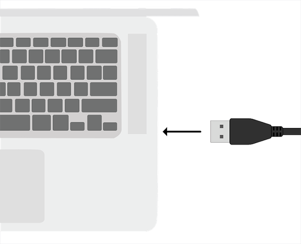
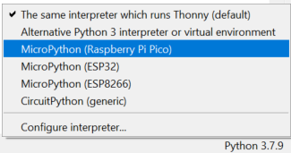
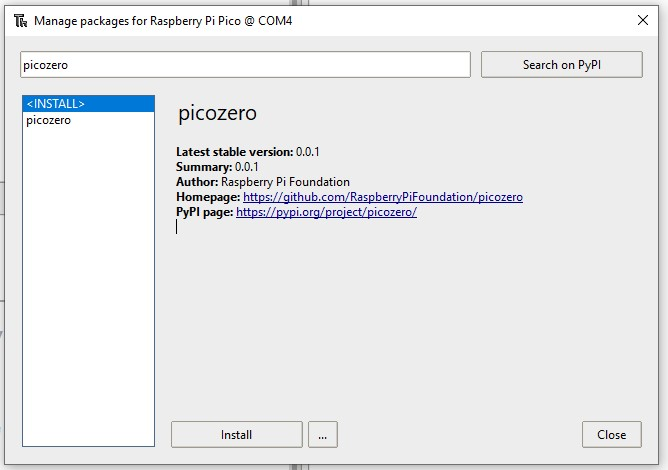

## Ställ in din Raspberry Pi Pico W

Anslut din Raspberry Pi Pico W och installera MicroPython.

MicroPython är en version av Python-programmeringsspråket för mikrokontroller, som din Raspberry Pi Pico W. MicroPython låter dig använda dina Python-kunskaper för att skriva kod för att interagera med elektronikkomponenter.

--- task ---

Ladda ner den senaste versionen av Raspberry Pi Pico W firmware på [https://rpf.io/pico-w-firmware](https://rpf.io/pico-w-firmware)

--- /task ---

--- task ---

**Anslut** den lilla änden av din mikro-USB-kabel till Raspberry Pi Pico W.

--- /task ---

--- task ---

Håll ned **BOOTSEL**-knappen på din Raspberry Pi Pico W.

--- /task ---

--- task ---

**Anslut** den andra änden till din stationära dator, bärbara dator eller Raspberry Pi.

--- /task ---

--- task ---

Din filhanterare bör öppnas, med Raspberry Pi Pico som visas som en externt ansluten enhet. Dra och släpp firmware-filen du laddade ner till filhanteraren. Din Raspberry Pi Pico bör kopplas från och filhanteraren stängs.

--- /task ---

--- task ---

Öppna Thonny-redigeraren.

--- /task ---

--- task ---

Titta på texten i det nedre högra hörnet av Thonny-redigeraren. Den kommer att visa dig vilken version av Python som används.

Om det **inte** säger "MicroPython (Raspberry Pi Pico)" där, klicka sedan på texten och välj "MicroPython (Raspberry Pi Pico)" från alternativen.

--- /task ---

--- task ---

**Felsökning:**

--- collapse ---
---
title: Jag vet inte om firmware är installerad och kan inte ansluta till min Pico
---

Se till att din Raspberry Pi Pico W är ansluten till din dator med en mikro-USB-kabel. Klicka på listan i det nedre högra hörnet av ditt Thonny-fönster. En popup-meny kommer att visas som listar tillgängliga programtolkar.

Om du inte kan se Pico i listan (som visas på bilden), måste du återansluta din Raspberry Pi Pico W samtidigt som du håller ned BOOTSEL-knappen för att montera den som en lagringsvolym, och sedan installera om firmware genom att följa instruktionerna i avsnittet ovan.

--- /collapse ---

--- collapse ---
---
title: Firmware är installerad men jag kan fortfarande inte ansluta till min Pico
---

Du kanske använder fel typ av mikro-USB-kabel. Din nuvarande mikro-USB-kabel kan vara skadad eller utformad för att bara överföra ström till enheter och inte överföra data. Prova att byta ut din kabel mot en annan om inget annat har fungerat.

Om din Pico fortfarande inte går att ansluta efter att ha provat alla dessa saker, kan den **själv** vara skadad och kan då inte anslutas.

--- /collapse ---

--- /task ---

För nykomlingar till Raspberry Pi Pico är `picozero` ett MicroPython-bibliotek som är nybörjarvänligt.

--- task ---

För att slutföra projekten på den här vägen måste du installera `picozero`-biblioteket som ett Thonny-paket.

I Thonny väljer du **Tools** > **Manage packages**.

--- /task ---

--- task ---

I popup-fönstret 'Manage packages for Raspberry Pi Pico' skriver du 'picozero' och klickar på **Search on PyPi**.

--- /task ---

--- task ---

Klicka på **picozero** i sökresultaten.

Klicka på **Install**.

När installationen är klar, stäng paketfönstret, avsluta och öppna Thonny igen.

--- /task ---

Om du har problem med att installera `picozero`-biblioteket i Thonny, kan du ladda ner biblioteksfilen och spara den på din Raspberry Pi Pico W.

[[[picozero-offline-install]]]
