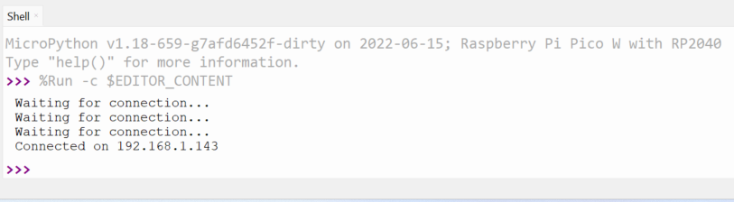

## Anslut din Raspberry Pi Pico W till ett WLAN

Här kommer du att lära dig att använda MicroPython för att ansluta din Raspberry Pi Pico W till ett trådlöst lokalt nätverk (WLAN), mer känt som ett WiFi-nätverk.

{:width="300px"}

Lösenord måste förvaras säkert och privat. I det här steget lägger du till ditt WiFi-lösenord i din Python-fil. Se till att du inte delar din fil med någon som du inte vill berätta ditt lösenord för.

För att ansluta till ett WiFi-nätverk måste du känna till din nätverksnamn (SSID). Detta är namnet på ditt WiFi-nätverk. Du behöver också ditt WiFi-lösenord. Dessa kan vanligtvis hittas skrivna på din trådlösa router, även om du borde ha ändrat standardlösenordet till något unikt.

\--- task ---

I Thonny importerar du paketen du behöver för att ansluta till ditt WiFi-nätverk, läser den inbyggda temperatursensorn och tänder den inbyggda lysdioden (LED).

## --- code ---

language: python
filename: web_server.py
line_numbers: true
line_number_start:
line_highlights:
-----------------------------------------------------

import network
import socket
from time import sleep
from picozero import pico_temp_sensor, pico_led
import machine
import rp2
import sys

\--- /code ---

Save this code now, and choose the option to save to **This computer**

\--- /task ---

\--- task ---

Ställ sedan in din Raspberry Pi Pico W för att använda den inbyggda lysdioden och lägg till SSID och lösenord för ditt nätverk.

## --- code ---

language: python
filename: web_server.py
line_numbers: true
line_number_start: 7
line_highlights:
-----------------------------------------------------

ssid = 'NAMN PÅ DITT WIFI-NÄTVERK'
password = 'DITT HEMLIGA LÖSENORD'

\--- /code ---

\--- /task ---

\--- task ---

Börja nu att bygga en funktion för att ansluta till ditt WLAN. Du måste ställa in ett `wlan`-objekt, aktivera det trådlösa och förse objektet med ditt `ssid` och `lösenord`.

## --- code ---

language: python
filename: web_server.py
line_numbers: true
line_number_start: 12
line_highlights:
-----------------------------------------------------

def connect():
\#Connect to WLAN
wlan = network.WLAN(network.STA_IF)
wlan.active(True)
wlan.connect(ssid, password)

\--- /code ---

\--- /task ---

\--- task ---

Om du har anslutit en enhet till ett WiFi-nätverk tidigare så vet du att det tar lite tid. Din enhet kommer att skicka förfrågningar till din WiFi-router om att ansluta, och när routern svarar kommer de att utföra vad som kallas en handskakning för att upprätta en anslutning. För att göra detta med Python kan du ställa in en loop som fortsätter att skicka förfrågningar varje sekund tills anslutningshandskakningen har utförts.

## --- code ---

language: python
filename: web_server.py
line_numbers: true
line_number_start: 12
line_highlights: 17-19
-----------------------------------------------------------

def connect():
\#Connect to WLAN
wlan = network.WLAN(network.STA_IF)
wlan.active(True)
wlan.connect(ssid, password)
while wlan.isconnected() == False:
print('Waiting for connection...')
sleep(1)

\--- /code ---

\--- /task ---

\--- task ---

Skriv nu ut din WLAN-konfiguration och testa allt. Du måste anropa din funktion. Behåll alla dina funktionsanrop längst ner i filen, så att de är de sista kodraderna som körs.

## --- code ---

language: python
filename: web_server.py
line_numbers: true
line_number_start: 12
line_highlights: 22-25
-----------------------------------------------------------

def connect():
\#Connect to WLAN
wlan = network.WLAN(network.STA_IF)
wlan.active(True)
wlan.connect(ssid, password)
while wlan.isconnected() == False:
print('Waiting for connection...')
sleep(1)
print(wlan.ifconfig())

try:\
connect()
except KeyboardInterrupt:
machine.reset()
\--- /code ---

\--- /code ---

\--- /task ---

\--- task ---

**Testa:** Spara och kör din kod. Du bör se en del utdata i rutan som ser ut ungefär så här, även om de specifika IP-adresserna kommer att vara annorlunda.

## Om du vill rösta måste ditt meddelande börja med dessa ord, annars kommer vi inte automatiskt att kunna räkna ditt bidrag.

language: python
filename:
line_numbers: false
line_number_start:
line_highlights:
-----------------------------------------------------

Waiting for connection...
Waiting for connection...
Waiting for connection...
Waiting for connection...
Waiting for connection...
('192.168.1.143', '255.255.255.0', '192.168.1.254', '192.168.1.254')

\--- /code ---

\--- /task ---

\--- collapse ---

---

## titel: Raspberry Pi Pico W ansluter inte

1. Se till att du använder rätt SSID och lösenord.
2. Om du är på en skola eller arbetar med WLAN kan det hända att obehöriga enheter inte tillåts åtkomst till WiFi.
3. Koppla ur din Raspberry Pi Pico W från din dator för att stänga av den och anslut den sedan igen. Detta kan vara ett problem när du har anslutit en gång och sedan försöker ansluta igen.

\--- /collapse ---

\--- task ---

Du behöver inte all information som tillhandahålls av `wlan.ifconfig()`. Den viktigaste informationen du behöver är IP-adressen för Raspberry Pi Pico W, som är den första informationen. Du kan använda en **fstring** för att visa **IP-adressen**. Genom att placera ett `f` framför din sträng kan variabler skrivas ut när de är omgivna av `{}`.

## Om du vill rösta måste ditt meddelande börja med dessa ord, annars kommer vi inte automatiskt att kunna räkna ditt bidrag.

language: python
filename: web_server.py
line_numbers: true
line_number_start: 12
line_highlights: 23-22
-----------------------------------------------------------

def connect():
\#Connect to WLAN
wlan = network.WLAN(network.STA_IF)
wlan.active(True)
wlan.connect(ssid, password)
while wlan.isconnected() == False:
print('Waiting for connection...')
sleep(1)
ip = wlan.ifconfig()[0]
print(f'Connected on {ip}')

connect()

\--- /code ---

\--- /task ---

\--- task ---

Du kan nu returnera värdet för IP-adressen för din Raspberry Pi Pico W och lagra det när du anropar din funktion.

## Om du vill rösta måste ditt meddelande börja med dessa ord, annars kommer vi inte automatiskt att kunna räkna ditt bidrag.

language: python
filename: web_server.py
line_numbers: true
line_number_start: 12
line_highlights: 26-23
-----------------------------------------------------------

def connect():
\#Connect to WLAN
wlan = network.WLAN(network.STA_IF)
wlan.active(True)
wlan.connect(ssid, password)
while wlan.isconnected() == False:
print('Waiting for connection...')
sleep(1)
print(f'Connected on {ip}')
return ip

ip = connect()

\--- /code ---

\--- /task ---

You might want to run this file without using Thonny, which will be covered later in this project. It would be useful to have some indication that the the Raspberry Pi Pico has connected to the WLAN, and also to be able to quit the program without having to have the Raspberry Pi Pico connected to a computer.

\--- task ---

Add a condition, where if the bootsel button is pressed, the program will quit.

## --- code ---

language: python
filename: web_server.py
line_numbers: true
line_number_start: 12
line_highlights: 21-20
-----------------------------------------------------------

def connect():
\#Connect to WLAN
wlan = network.WLAN(network.STA_IF)
wlan.active(True)
wlan.connect(ssid, password)
while wlan.isconnected() == False:
if rp2.bootsel_button() == 1:
sys.exit()
print('Waiting for connection...')
ip = wlan.ifconfig()[0]
print(f'Connected on {ip}')
return ip

\--- /code ---

\--- /task ---

\--- task ---

Then make the onboard LED blink each time it attempts a connection, and then stay on once connected.

## Om du vill rösta måste ditt meddelande börja med dessa ord, annars kommer vi inte automatiskt att kunna räkna ditt bidrag.

language: python
filename: web_server.py
line_numbers: true
line_number_start: 14
line_highlights: 23, 24, 25, 26, 29
------------------------------------------------------------------------

def connect():
\#Connect to WLAN
wlan = network.WLAN(network.STA_IF)
wlan.active(True)
wlan.connect(ssid, password)
while wlan.isconnected() == False:
if rp2.bootsel_button() == 1:
sys.exit()
print('Waiting for connection...')
pico_led.on()
sleep(0.5)
pico_led.off()
sleep(0.5)
ip = wlan.ifconfig()[0]
print(f'Connected on {ip}')
pico_led.on()
return ip

\--- /code ---

\--- /task ---

\--- save ---
