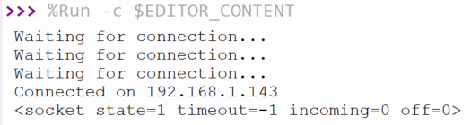

## Öppna en socket

I det här steget använder du anslutningen till ditt WLAN för att öppna en socket.

{:width="300px"}

En socket är hur en **server** kan lyssna efter en **klient** som vill ansluta till den. Webbsidan du för närvarande tittar på finns på Raspberry Pi Foundation-servrar. Dessa servrar har en öppet socket som väntar på att din webbläsare ska upprätta en anslutning, varvid innehållet på webbsidan skickas till din dator. I det här fallet kommer din server att vara din Raspberry Pi Pico W och klienten kommer att vara en webbläsare på en annan dator.

För att öppna en socket måste du ange IP-adressen och ett portnummer. Portnummer används av datorer för att identifiera var förfrågningar ska skickas. Till exempel, port `80` används normalt för webbtrafik; Stardew Valley använder port `24642` när du spelar ett spel för flera spelare. När du ställer in en webbserver kommer du att använda port `80`.

\--- task ---

Skapa en ny funktion som kan anropas för att öppna en socket. Det bör vara över din `try`/`except`. Börja med att ge socketen en IP-adress och ett portnummer.

## --- code ---

language: python
filename: web_server.py
line_numbers: true
line_number_start: 25
line_highlights:
-----------------------------------------------------

def open_socket(ip):
\# Open a socket
address = (ip, 80)

try:
connect()
except KeyboardInterrupt:
machine.reset()
\--- /code ---

\--- /task ---

\--- task ---

Skapa nu din socket och låt den sedan lyssna efter förfrågningar på port `80`. Glöm inte att anropa din funktion längst ner i din kod.

## --- code ---

language: python
filename: web_server.py
line_numbers: true
line_number_start: 25
line_highlights: 28-31
-----------------------------------------------------------

def open_socket(ip):
\# Open a socket
address = (ip, 80)
connection = socket.socket()
connection.bind(address)
connection.listen(1)
print(connection)

try:
ip = connect()
open_socket(ip)
except KeyboardInterrupt:
machine.reset()

\--- /code ---

\--- /task ---

\--- task ---

**Test:** Kör din kod så bör du se en utdata som ser ut ungefär så här.

## --- code ---

language: python
filename:
line_numbers: false
line_number_start:
line_highlights:
-----------------------------------------------------

> > > %Run -c $EDITOR_CONTENT
> > > Waiting for connection...
> > > Waiting for connection...
> > > Waiting for connection...
> > > Waiting for connection...
> > > Waiting for connection...
> > > Connected on 192.168.1.143
> > >
> > > <socket state=1 timeout=-1 incoming=0 off=0>

\--- /code ---

`socket state=1` talar om för dig att din socket fungerar.

\--- /task ---

\--- task ---

Slutligen, ersätt din `print` med en `return` och lagra sedan den returnerade socket-anslutningen som en variabel.

## --- code ---

language: python
filename: web_server.py
line_numbers: true
line_number_start: 25
line_highlights: 31, 36
------------------------------------------------------------

def open_socket(ip):
\# Open a socket
address = (ip, 80)
connection = socket.socket()
connection.bind(address)
connection.listen(1)
return connection

try:
ip = connect()
connection = open_socket(ip)
except KeyboardInterrupt:
machine.reset()

\--- /code ---

\--- /task ---

Du har nu din Raspberry Pi Pico W som lyssnar efter anslutningar till dess IP-adress på port `80`. Det betyder att den är redo att börja visa HTML-kod, så att en ansluten webbläsare kan se en webbsida.

\--- save ---
