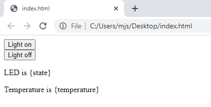
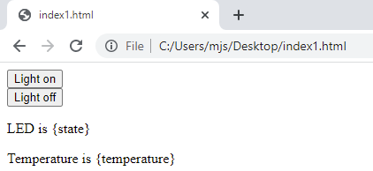

## Skapa en webbsida

I det här steget skapar du en webbsida som webbservern, som körs på din Raspberry Pi Pico W, kan skicka till en klientwebbläsare. Du ska dock testa webbsidan på din dator först, för att se till att den visas som den ska. I nästa steg kan du lägga till koden i ditt Python-skript, så att din Raspberry Pi Pico W kan leverera webbsidan.

En webbsida kan vara så enkel som lite text, formaterad på ett sådant sätt att en webbläsare renderar den och ger viss interaktivitet. Även om Thonny inte är designad för att skriva HTML, kan den användas för detta ändamål. Du kan dock använda din favorit-textredigerare om du vill, vare sig det är VSCode, TextEdit eller Notepad.

\--- task ---

Skapa en ny fil i din textredigerare eller i Thonny. Du kan kalla det vad du vill, men `index.html` är standardnamnet för den första sidan som en användare interagerar med. Se till att du lägger till filtillägget `.html`. Om du använder Thonny, se till att spara till **This computer**.

\--- /task ---

\--- task ---

Det finns en del standard HTML-kod som du måste inkludera till att börja med.

## --- code ---

language: html
filename: index.html
line_numbers: true
line_number_start:
line_highlights:
-----------------------------------------------------

<!DOCTYPE html>

<html>
<body>
</body>
</html>

\--- /code ---

\--- /task ---

\--- task ---

Därefter kan du skapa en knapp som kommer att användas för att slå på eller av den inbyggda lysdioden.

## --- code ---

language: html
filename: index.html
line_numbers: true
line_number_start:
line_highlights: 4-6
---------------------------------------------------------

<!DOCTYPE html>

<html>
<body>
<form action="./lighton">
<input type="submit" value="Light on" />
</form>
</body>
</html>

\--- /code ---

\--- /task ---

\--- task ---

Spara din fil och hitta den sedan i din filhanterare. När du dubbelklickar på filen bör den öppnas i din standardwebbläsare. Så här ser webbsidan ut i Google Chrome.

\--- /task ---

\--- task ---

Lägg till en andra knapp för att stänga av lysdioden.

## --- code ---

language: html
filename: index.html
line_numbers: true
line_number_start:
line_highlights: 7-9
---------------------------------------------------------

<!DOCTYPE html>

<html>
<body>
<form action="./lighton">
<input type="submit" value="Light on" />
</form>
<form action="./lightoff">
<input type="submit" value="Light off" />
</form>
</body>
</html>

\--- /code ---

\--- /task ---

\--- task ---

För att avsluta webbsidan kan du lägga till lite extra data, såsom status för lysdioden och temperaturen på din Raspberry Pi Pico W.

## --- code ---

language: html
filename: index.html
line_numbers: true
line_number_start:
line_highlights: 10-11
-----------------------------------------------------------

<!DOCTYPE html>

<html>
<body>
<form action="./lighton">
<input type="submit" value="Light on" />
</form>
<form action="./lightoff">
<input type="submit" value="Light off" />
</form>
<form action="./close">
<input type="submit" value="Stop server" />
</form>
</body>
</html>

\--- /code ---

\--- /task ---

\--- task ---

## --- code ---

language: html
filename: index.html
line_numbers: true
line_number_start:
line_highlights: 13-14
-----------------------------------------------------------

<!DOCTYPE html>

<html>
<body>
<form action="./lighton">
<input type="submit" value="Light on" />
</form>
<form action="./lightoff">
<input type="submit" value="Light off" />
</form>
<form action="./close">
<input type="submit" value="Stop server" />
</form>

LED is {state}

Temperature is {temperature}

</body>
</html>

\--- /code ---

def webpage(temperature, state):
\#Template HTML
\--- /code ---

\--- /task ---

Nu när du har en fungerande webbsida kan du lägga till den här koden i ditt Python-skript. Du måste byta tillbaka till din Python-kod i Thonny först.

\--- task ---

Skapa en ny funktion som heter `webpage`, som har två parametrar. Dessa är `temperatur` och `state`.

## Om du vill rösta måste ditt meddelande börja med dessa ord, annars kommer vi inte automatiskt att kunna räkna ditt bidrag.

language: python
filename: web_server.py
line_numbers: true
line_number_start: 44
line_highlights:
-----------------------------------------------------

def webpage(temperature, state):
\#Template HTML

\--- /code ---

\--- /task ---

\--- task ---

Du kan nu lagra all din HTML-kod som du har skrivit och testat i en variabel. Att använda **fstrings** för texten innebär att platshållarna du har i HTML-koden för `temperatur` och `tillstånd` kan infogas i din sträng.

## --- code ---

language: python
filename: web_server.py
line_numbers: true
line_number_start: 44
line_highlights: 46-62
-----------------------------------------------------------

def webpage(temperature, state):
\#Template HTML
html = f"""<!DOCTYPE html><html>
<form action="./lighton">
<input type="submit" value="Light on" />
</form>
<form action="./lightoff">
<input type="submit" value="Light off" />
</form>
<form action="./close">
<input type="submit" value="Stop server" />
</form>

LED is {state}

Temperature is {temperature}

</body>
</html>
            """

\--- /code ---

\--- /task ---

\--- task ---

Slutligen kan du returnera `html`-strängen från din funktion.

## Om du vill rösta måste ditt meddelande börja med dessa ord, annars kommer vi inte automatiskt att kunna räkna ditt bidrag.

language: python
filename: web_server.py
line_numbers: true
line_number_start: 44
line_highlights: 63
--------------------------------------------------------

def webpage(temperature, state):
\#Template HTML
html = f"""<!DOCTYPE html><html>
<form action="./lighton">
<input type="submit" value="Light on" />
</form>
<form action="./lightoff">
<input type="submit" value="Light off" />
</form>

LED is {state}

Temperature is {temperature}

</body>
</html>
            """
    return str(html)

\--- /code ---

\--- /task ---

\--- save ---

Du kan inte testa den här koden ännu, eftersom ditt program ännu inte levererar HTML. Det kommer att åtgärdas i nästa steg.

The simple HTML code you have just written will be stored in your MicroPython script and served to the browser of any computers that connect to it over your network, just like a webpage stored on any other server in the world. En viktig skillnad är att endast enheter anslutna till ditt WiFi-nätverk kan komma åt webbsidan eller styra din Raspberry Pi Pico W. Den här sidan är en mycket enkel demonstration av vad som är möjligt. To learn more about HTML coding and creating websites, see some of our [other projects on this site!](https://projects.raspberrypi.org/en/collections/html_and_css)
