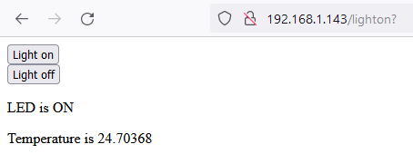

## Visa din webbsida

<div style="display: flex; flex-wrap: wrap">
<div style="flex-basis: 200px; flex-grow: 1; margin-right: 15px;">
I det här steget kommer du att starta upp din webbserver så att en klient kan ansluta till den, och styra din LED och läsa av temperaturen.
</div>
<div>

</div>
</div>

\--- task ---

Skapa en funktion som startar din webbserver, med hjälp av `connection`-objektet du sparade som en parameter. Variablerna `state` och `temperature` måste ställas in för dina HTML-data. Tillståndet kommer att börja som inställt på "OFF" och temperaturen till "0", vilket betyder att du också bör se till att lysdioden är släckt när servern startar.

## --- code ---

language: python
filename: web_server.py
line_numbers: true
line_number_start: 53
line_highlights: 57-58
-----------------------------------------------------------

def serve(connection):
\#Start a web server
state = 'OFF'
pico_led.off()
temperature = 0
\--- /code ---

\--- /code ---

\--- /task ---

När din webbläsare ber om en anslutning till din Raspberry Pi Pico W måste anslutningen accepteras. Därefter måste de data som skickas från din webbläsare göras i specifika bitar (i detta fall, 1024 bytes). Du måste också veta vilken begäran din webbläsare gör – ber den bara om en enkel sida? Frågar det efter en sida som inte finns?

\--- task ---

Du vill hålla webbservern uppe och lyssna hela tiden, så att vilken klient som helst kan ansluta till den. Du kan göra detta genom att lägga till en `while True:`-loop. Lägg till dessa fem rader kod så att du kan acceptera en begäran, och `print()` för att se vad begäran var. Lägg till ett anrop till din `serve`-funktion i dina anrop längst ner i din kod.

## --- code ---

language: python
filename: web_server.py
line_numbers: true
line_number_start: 53
line_highlights: 58-63, 69
---------------------------------------------------------------

def serve(connection):
\#Start a web server
state = 'OFF'
pico_led.off()
temperature = 0
while True:
client = connection.accept()[0]
request = client.recv(1024)
request = str(request)
print(request)
client.close()

try:
ip = connect()
connection = open_socket(ip)
serve(connection)
except KeyboardInterrupt:
machine.reset()
\--- /code ---

\--- /code ---

\--- /task ---

Du borde se något liknande i utdata i Thonny.

Du borde se något liknande i utdata i Thonny.

Du borde se något liknande i utdata i Thonny.

```python
>>> %Run -c $EDITOR_CONTENT
Waiting for connection...
Waiting for connection...
Waiting for connection...
Connected on 192.168.1.143
b'GET / HTTP/1.1\r\nHost: 192.168.1.143\r\nUser-Agent: Mozilla/5.0 (Windows NT 10.0; Win64; x64; rv:101.0) Gecko/20100101 Firefox/101.0\r\nAccept: text/html,application/xhtml+xml,application/xml;q=0.9,image/avif,image/webp,*/*;q=0.8\r\nAccept-Language: en-GB,en;q=0.5\r\nAccept-Encoding: gzip, deflate\r\nConnection: keep-alive\r\nUpgrade-Insecure-Requests: 1\r\n\r\n'
b'GET /favicon.ico HTTP/1.1\r\nHost: 192.168.1.143\r\nUser-Agent: Mozilla/5.0 (Windows NT 10.0; Win64; x64; rv:101.0) Gecko/20100101 Firefox/101.0\r\nAccept: image/avif,image/webp,*/*\r\nAccept-Language: en-GB,en;q=0.5\r\nAccept-Encoding: gzip, deflate\r\nConnection: keep-alive\r\nReferer: http://192.168.1.143/\r\n\r\n'
```

\--- task ---

Därefter måste du skicka HTML-koden du har skrivit till klientens webbläsare.

## --- code ---

language: python
filename: web_server.py
line_numbers: true
line_number_start: 66
line_highlights: 76, 77
------------------------------------------------------------

try:
ip = connect()
connection = open_socket(ip)
serve(connection)
except KeyboardInterrupt:
machine.reset()
\--- /code ---

try:
ip = connect()
connection = open_socket(ip)
serve(connection)
except KeyboardInterrupt:
machine.reset()
\--- /code ---

\--- /code ---

\--- /task ---

\--- task ---

Uppdatera din sida när du har kört koden igen. Klicka på knapparna som visas. I Thonny bör du då se att det blir två olika resultat.

```python
b'GET /lighton? HTTP/1.1\r\nHost: 192.168.1.143\r\nUser-Agent: Mozilla/5.0 (Windows NT 10.0; Win64; x64; rv:101.0) Gecko/20100101 Firefox/101.0\r\nAccept: text/html,application/xhtml+xml,application/xml;q=0.9,image/avif,image/webp,*/*;q=0.8\r\nAccept-Language: en-GB,en;q=0.5\r\nAccept-Encoding: gzip, deflate\r\nConnection: keep-alive\r\nReferer: http://192.168.1.143/\r\nUpgrade-Insecure-Requests: 1\r\n\r\n'
```

och

```python
b'GET /lightoff? HTTP/1.1\r\nHost: 192.168.1.143\r\nUser-Agent: Mozilla/5.0 (Windows NT 10.0; Win64; x64; rv:101.0) Gecko/20100101 Firefox/101.0\r\nAccept: text/html,application/xhtml+xml,application/xml;q=0.9,image/avif,image/webp,*/*;q=0.8\r\nAccept-Language: en-GB,en;q=0.5\r\nAccept-Encoding: gzip, deflate\r\nConnection: keep-alive\r\nReferer: http://192.168.1.143/lighton?\r\nUpgrade-Insecure-Requests: 1\r\n\r\n'
```

\--- /task ---

Lägg märke till att du har `/lighton?`, `lightoff?` och `close?` i förfrågningarna. These can be used to control the onboard LED of your Raspberry Pi Pico W and close your server.

\--- task ---

Dela förfrågningssträngen och hämta sedan det första objektet i listan. Ibland kan förfrågningssträngen kanske inte delas, så det är bäst att hantera detta i ett `try`/`except`.

Om det första objektet i uppdelningen är `lighton?` kan du slå på lysdioden. Om det är `lightoff?` kan du stänga av lysdioden. If it is `close?` you can perform a `sys.exit()`

## --- code ---

language: python
filename: web_server.py
line_numbers: true
line_number_start: 66
line_highlights: 75-85
-----------------------------------------------------------

def serve(connection):
\#Start a web server
state = 'ON'
pico_led.on()
temperature = 0
while True:
client = connection.accept()[0]
request = client.recv(1024)
request = str(request)
try:
request = request.split()[1]
except IndexError:
pass
if request == '/lighton?':
pico_led.on()
elif request =='/lightoff?':
pico_led.off()
elif request == '/close?':
sys.exit()\
html = webpage(temperature, state)
client.send(html)
client.close()

\--- /code ---

\--- /task ---

\--- task ---

Kör din kod igen. Den här gången, när du uppdaterar ditt webbläsarfönster och klickar på knapparna, bör den inbyggda LED-lampan tändas och släckas. If you click on the **Stop Server** button, your server should shutdown.

\--- /task ---

\--- task ---

def serve(connection):
\#Start a web server
state = 'OFF'
pico_led.off()
temperature = 0
while True:
client = connection.accept()[0]
request = client.recv(1024)
request = str(request)
try:
request = request.split()[1]
except IndexError:
pass
if request == '/lighton?':
pico_led.on()
state = 'ON'
elif request =='/lightoff?':
pico_led.off()
state = 'OFF'
html = webpage(temperature, state)
client.send(html)
client.close()

## --- code ---

language: python
filename: web_server.py
line_numbers: true
line_number_start: 66
line_highlights: 81, 84
------------------------------------------------------------

Nu när du kör koden bör texten för statusen för lysdioden också ändras på den uppdaterade webbsidan.

\--- /code ---

Slutligen kan du använda den inbyggda temperatursensorn för att få en ungefärlig avläsning av CPU-temperaturen och visa den på din webbsida också.

\--- /task ---

\--- task ---

def serve(connection):
\#Start a web server
state = 'OFF'
pico_led.off()
temperature = 0
while True:
client = connection.accept()[0]
request = client.recv(1024)
request = str(request)
try:
request = request.split()[1]
except IndexError:
pass
if request == '/lighton?':
pico_led.on()
state = 'ON'
elif request =='/lightoff?':
pico_led.off()
state = 'OFF'
temperature = pico_temp_sensor.temp
html = webpage(temperature, state)
client.send(html)
client.close()

## --- code ---

language: python
filename: web_server.py
line_numbers: true
line_number_start: 66
line_highlights: 87
--------------------------------------------------------

def serve(connection):
\#Start a web server
state = 'ON'
pico_led.on()
temperature = 0
while True:
client = connection.accept()[0]
request = client.recv(1024)
request = str(request)
try:
request = request.split()[1]
except IndexError:
pass
if request == '/lighton?':
pico_led.on()
state = 'ON'
elif request =='/lightoff?':
pico_led.off()
state = 'OFF'
elif request == '/close?':
sys.exit()
temperature = pico_temp_sensor.temp
html = webpage(temperature, state)
client.send(html)
client.close()

\--- /code ---

\--- /task ---

\--- task ---

**Test:** Du kan hålla handen över din Raspberry Pi Pico W för att höja dess temperatur och sedan uppdatera webbsidan på din dator för att se det nya värdet som visas.

\--- /task ---
